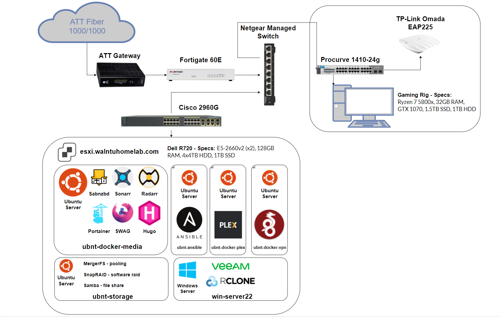

Now that we've taken a trip to the past, let's play some catch-up! I've done quite a lot with my homelab since that old post, and I'd like to share what worked, what didn't, and what I'm still implementing.

## Why "WalnutHomelab"?

I chose this name because I briefly took up woodworking as a hobby, and walnut very quickly became my favorite type of wood. I wanted to pick a unique for my first domain name, so I ended up here.

## The Labtm

As you can see, quite a lot has changed from the previous state of things. First off, I moved. After a job change that resulted in me being closer to my girlfriend's home than my parents', I moved into her place. I did not, however, bring my lab with me. The original server remains at my parents' place, and serves as my Wireguard/Ubiquiti machine so I can continue maintaining things if I need to. I still visit once in a while, so I can keep an eye on the server and the network remotely and in person.

## The Seed

The seed of upgrading my lab was planted when I stumbled across a Reddit post of someone local to my area selling used enterprise servers for really great prices. I had considered a lab upgrade several times by this point, especially since my SuperMicro motherboard at the time was only capable of supporting 32gb of RAM, and I was starting to bump against that limit more and more often. I did some research on rack servers and decided -- as many have over the years -- that my ideal rack mounted server would be a Dell R720. Alas, my local Reddit server shop didn't have any of those for sale. However, I got a pretty decent deal on a used, barebones (all it had was power supplies and a RAID card) Dell R720 for \$200 on eBay. After even more research, it occurred to me that the generation of HP servers being sold by the aforementioned Redditor was the same hardware generation as the Dell I just bought. I reached out, paid $125, and walked away with a great deal on an HP DL360p Gen8 with the exact specs I was looking for at pretty much half the price. After learning a bit about server hardware, acquiring some VMware licenses, and going through the ESXi installation process, I ended up with the beauty you see in the image above.

## Migration

My migration journey began with a plan of sorts to migrate my existing infrastructure from a Hyper-V machine to an ESXi machine. Here are the steps I planned out verbatim from an r/Homelab Discord server post I made:

1. Backup all VMs and media to 4tb WD My Book
2. Hypervisor install - Going from Hyper-V server to VMware, will install VMware on an SD card to boot from, create datastore for VMs on a 1tb NVMe drive
3. VM transfer - Use StarWind V2V Converter to convert my Hyper-V VHDX to VMware VMDK, boot them all up and test for functionality
4. Media transfer - Planning to utilize MergerFS + SnapRAID for my file storage/redundancy solution using 4x4tb (1 Seagate Ironwolf and 3 WD Red Plus), copy all media from the backup drive to the newly created MergerFS pool

Seemed straightforward enough. Except I didn't do some of step 1, or any of step 3. I tried converting a single VM from Hyper-V to ESXi, but the process felt... dirty? I guess it was mainly because I'd never really used ESXi before, so I didn't know how anything was supposed to look or work. What I ended up doing instead was backing up all the relevant data from my existing server (almost everything was docker containers so I just backed up my compose file and the config folders), and learned how to create VMs from scratch. After slowly but surely provisioning all my VMs using a variety of methods (mostly Ansible, more on that in another post), I was back up and running in just a couple of days worth of after-work tinkering sessions.

## So what actually changed?

A LOT. I've got a ton of stuff to write about, and although I'm feeling tuckered out from this first post, I hope it doesn't reduce my desire to self-document my lab process. I think this covers the bulk of my initial struggles and some of the thought process for my changes, but I'll go into more detail later on some things.
